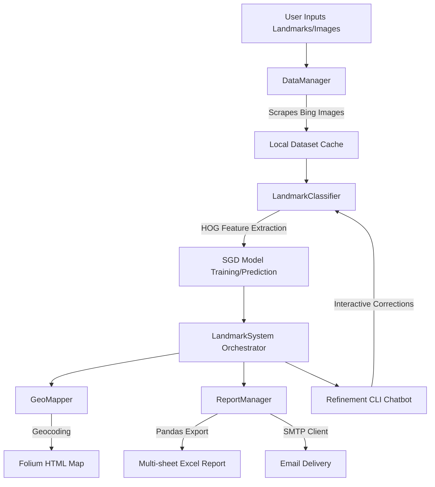

# Accessibility-Friendly Landmark Buddy

An end-to-end, command-line based Landmark Recognition & Spatial Information System. This application automates the process of gathering architectural imagery, training a custom machine learning model on-the-fly, predicting landmarks from text queries or physical images, geolocating them on an interactive map, and compiling professional, multi-sheet analytical reports.

---

## 🚀 Key Features

*   **Automated Dataset Scraping**: Uses a custom scraping engine to query and download verified landmark images (JPG, PNG, WebP) from Bing. Features query expansion (e.g., generating interior/exterior architectural terms) to maximize feature diversity.
*   **HOG & SGD Machine Learning**: Extracts **Histogram of Oriented Gradients (HOG)** spatial/texture features from images and trains an online **SGDClassifier** with log-loss.
*   **Adaptive Reward-Penalty Training**: Features a dynamic epoch system that scales training budgets up when validation scores improve (rewards) or halts early when performance plateaus (penalties).
*   **Interactive Folium Mapping**: Converts identified landmark names into coordinate pairs using Nominatim and constructs interactive HTML maps (`landmark_map.html`) with colored confidence markers (Green/Orange/Red).
*   **Advanced Excel Reporting**: Autogenerates a structured multi-sheet Excel spreadsheet (`landmark_analysis.xlsx`) documenting raw model outputs, summary statistics, geographic coordinates, and accessibility/compatibility verdicts.
*   **Conversational Feedback Loop**: A terminal-based CLI chatbot allows you to review predictions, correct erroneous classifications (e.g., `correct 0 to Eiffel Tower`), run instant model retraining, and trigger automated emails of generated reports.
*   **Tkinter & SMTP Integrations**: Integrates native desktop save-dialogs for reports and secure SMTP support (with SSL/TLS configuration) to distribute Excel files directly to users.

---

## 🛠️ System Prerequisites & Installation

The application requires a Python 3.8+ environment. Since it includes an interactive file-saving utility, your system must support a graphical window manager for `tkinter` (e.g., X11 on Linux or built-in windowing on macOS/Windows).

### 1. Install System Dependencies
On Debian/Ubuntu systems, ensure `tkinter` is installed:
```bash
sudo apt-get update
sudo apt-get install python3-tk
```

### 2. Install Python Packages
Install the required scientific and utility libraries:
```bash
pip install numpy requests beautifulsoup4 scikit-image scikit-learn geopy folium pandas openpyxl xlsxwriter joblib Pillow python-dotenv
```

---

## ⚙️ Configuration (`.env`)

To enable automated email distribution, create a `.env` file in the root directory:

```env
# SMTP Mail Settings
SMTP_SERVER=smtp.gmail.com
SMTP_PORT=587
SMTP_USE_SSL=true
SENDER_EMAIL=your-system-email@gmail.com
SENDER_PASSWORD=your-app-specific-password
```

---

## 🧠 Architectural Workflow

The system is organized into decoupled services coordinated by the orchestrator:



---

## 📖 Usage Guide

Run the main consolidated script to begin:

```bash
python "Code 3; Acessibility-friendly landmark buddy"
```

### Step 1: User Registration
The program prompts for an email address. This is registered as the default recipient for compiled reports.

### Step 2: Training Phase
Enter a list of landmark terms separated by semicolons:
```text
Enter landmark names to train on (separated by ';'): Eiffel Tower; Statue of Liberty; Colosseum
```
The scraper will fetch up to 15 unique views (including interior and exterior perspectives) for each target, process the features, and run the adaptive training routine.

### Step 3: Analysis & Prediction
Supply a mix of local image paths or text queries to run consensus analyses:
```text
Enter text queries and/or image paths (separated by ';'): /path/to/my_trip_photo.jpg; Eiffel Tower
```

### Step 4: Refinement Chat Commands
Once predictions are calculated, you enter the interactive feedback loop. The following commands are supported:

| Command | Action / Syntax Example | Description |
| :--- | :--- | :--- |
| `list` | `list` | Prints out all loaded items, their indices, predictions, and confidence levels. |
| `correct` | `correct 0 to Colosseum` <br> *or* `0: Colosseum` | Manually overrides an incorrect classification and marks it for spatial recalculation. |
| `retrain` | `retrain` | Triggers partial-fit retraining using only corrected samples. |
| `send` | `send` | Emails the final generated Excel report and map links to your registered address. |
| `quit` | `quit` | Exits the program and prints the final performance metrics. |
